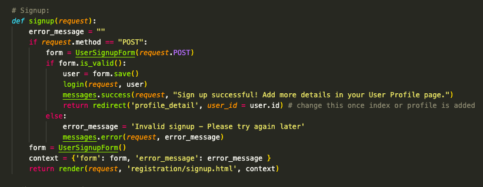

<p align="center">
    
</p>

# 'Forage' : SEI Project 3        

## Description:     
This is an image-based, _Pinterest_-type 'mood board' web app, built as a team of three ([Helene](https://github.com/HelenevB), [Ivan](https://github.com/ic188002) and I) in one week using Python within a Django framework, linked to PostgreSQL SQL database. Users can sign up, upload images, create mood boards and then link both their own or other users' images to their 'boards' This project was completed as the third project for General Assembly London's Software Engineering Immersive course, and was presented to my Instructional Team and fellow SEI cohort on 07/10/22.          

My particular focus for this project was primarily on User functionality: signup, authentication and authorisation, profile CRUD operations and password reset. I also worked on formatting and _Materialize_ 'Toast' notifications for User feedback. This project was my first experience of working as a 'team member' (rather than team leader) within a group, and my first experience of working in a group of 3 or more developers.      

     

## Links:       
[Deployment link](https://namesei66.herokuapp.com/)      
[Google Doc README](https://docs.google.com/document/d/1nJy5gzf3n5Jnp8f--a1C0feFb3mQ6IKMfbIpt3UtLls/edit?usp=sharing)      

## Getting started & Install:       

To use the app, please feel free to create an account (your real email is not required!) and start exploring.       

_Please note_ that at present, there is an issue with image upload where Heroku's ephemeral file storage deletes any newly uploaded images after less than 24 hours. As such, many of the image links are currently broken where uploaded files have been removed, and any images newly uploaded will not persist past a 24 hour period before breaking.

To contribute, please fork from GitHub and then run `pip install -r requirements.txt` to install the required dependencies, alternatively see `requirements.txt`, submitting a pull request for any completed contributions.        

## Technologies used:       
- Written using HTML5, CSS3, Python3 in Visual Studio Code.        
- Built using a Django framework linked to a PostgreSQL database.       
- Psycopg2 PostgreSQL database driver, sqlparse SQL parser.         
- Materialize CSS library, Pillow Python imaging library.        
- Hosted on Heroku.     

## Brief & Project aims:       

The brief for this project was to create a Full Stack web application as a group, in one week, using Python, Django and PostgreSQL. Technical requirements included:        
- Use at least 2 related models, one of which being User, with all major CRUD operations required for at least one model.       
- Add authentication and authorisation to restrict access to appropriate users. Include signup, sign in, change password and logout functionality. Give user feedback after each action.     
- Layout and style frontend using clean and well-formatted CSS (and if required - use a framework for this).        

Stretch goals included:     
- Send verification email upon registration, allow password reset via email.        
- Allow users to upload images.     

The aim of the project was to consolidate two intensive weeks of learning the Python programming language and working with Django and SQL databases (specifically PostgreSQL). Further to this, this project allowed me to take what I had learned about group Git and working as a pair, and then apply this to working in a larger team of three - this time as a 'Team Member' rather than 'Team Leader'. Concepts covered included relational database modelling, Django Models, Class-based views and MVT architecture.          

       

## Key takeaways and learnings:       

I enjoyed this project as it was an opportunity to create a web app using a 'new' language after 6 weeks of JavaScript. I had spent some time self-teaching Python before starting the course - so had a bit of familiarity with its syntax - but crucially I found that the concepts and skills learned on JS translated across really quickly into Python having come back to it after a few months. Picking things up comparatively quickly was a great feeling!

It was a great experience working as a team of three for the first time, especially as we all had such different strengths and weaknesses (and indeed personalities and approaches!). Our 'team culture' was supportive and many of the challenges faced in Project 2 were much easier to overcome the second time around.      

Lastly, I had fun working with Django, especially using the 'baked in' functionality as compared to Express' more minimalist framework. I found it to be quick to pick up and I was a fan of the built-in admin app and auth features. Looking back, Python and Django seems somewhat 'alien' to me now, but I know that this project was great for my confidence, and has been a great foundation, putting me in a great place for when I revisit Python and Django in the future.        

Key learnings were as follows:      
- Git / GitHub repository setup and configuration are _extremely_ important. I got this wrong at the start of this project which meant that the structure and routines that I was used to for version control would not work as expected. This caused a lot of initial difficulty! By adapting my approach I was eventually able to find a way of working that overcame these difficulties.       
- Careful - and detailed - planning is key when working with SQL databases. 'In-flight' changes to the ERD can cause a lot of headaches: it is much better to spend the time getting this right from 'day one' rather than spending more time making changes later on.      
- Migrations can be - for lack of a better term - a nightmare when things go wrong! This led to occasional instances where we would 'break' our database and have to try and resuscitate it. By the same token, `__pycache__` files caused us a lot of unnecessary drama: it was only later in the project that we realised that our `.gitignore` file was key to minimising conflicts (as opposed to manual deletions of problematic files - _not the right way of doing things_!).        
- Configuring back-end email is not easy! Making the decision to go in a different direction and invest time into other features was the right one. That said, I would love to go back and get this working in future!      
- User Profile models are a powerful and effective way of adding functionality to the built-in User model. I am very glad that I chose this approach rather than the alternatives!        
- Leveraging individual strengths and talents is a great way of getting the most out of everyone. We did a great job of supporting each other in this way, by focusing on areas where we were more comfortable, and seeking help in areas where we were less comfortable.       

      
_A really helpful pointer from Helene via Slack - one of many examples of where we helped and supported each other when facing challenges!_     

## Successes and Challenges:         

This project was as rewarding as it was challenging, with the confidence and knowledge gained as a result of overcoming challenges being the most important successes. The 'learns' above were amongst the most major successes, stemming from some of the most difficult aspects of /moments within the project. Some further 'wins' for me were:   

- Personally implementing User Profile models, along with all major CRUD functions. This covered the majority of technical requirements for the project; whilst challenging at times, it was also very rewarding - getting everything up and running was a great feeling and I really enjoyed working with authentication and authorisation for the first time on a project.        
- Gaining further confidence with CSS: I found work on styling notably easier this time around, and was able to produce better results much more quickly than I had in earlier projects. We were able to roll out much of the styling work completed on User Profile templates to other templates - being able to make this contribution represented, for me, a real step forward in my confidence and competence with CSS.     
- Getting really positive feedback from our Lead Instructor for implementing Materialize 'Toast' notifications. This was a challenging piece of work, and getting acknowledgement following the presentation that this was a complex (and given our experience, impressive) addition was a fantastic feeling and a real boost for my confidence!        
- Delivering a project that (despite many delays due to git issues) hit all technical brief requirements and is - Heroku image issue notwithstanding - largely bug-free was a real success, thanks largely to our careful planning and realistic expectations.       

Further to the challenges detailed in 'Key takeaways and learnings' above (particularly version control and migrations) other key challenges included:      

- Fully grasping the concepts around relationed SQL databases (having previously worked with NoSQL databases): in particular, properly 'getting' how join tables work and are used was difficult, especially at the start of the project when producing our ERD. I thought I understood these concepts before we started this project but soon found my understanding challenged! Happily though, this project was - as intended - a great way to condense and clarify my understanding of SQL concepts, and I came out of it with a much more robust grasp of these!       
- I found using Django Templating Language a real challenge at times: I would expect certain functionality seen in Python to also be available in DTL (when it wasn't), and I found the documentation / help articles / _stackoverflow_ answers to be a lot more sparse as compared to other technologies.     
- Implementing Toast message notifications as above took a lot of trial and error: I was able to get `<p>{{message}}</p>` to work, `[...] onclick.M.toast(‘I’m a toast message!’)[...]` to work, but not - as per the Materialize documentation - `<script>M.toast({html: "{{message}}", classes: 'green rounded', displayLength:2000});</script>` (instead getting 'M' is not defined). Finding the solution of including a `DOMContentLoaded` event listener within the script tag before running `M.toast` was a big moment as it was the first time I had come across 'synchronicity' issues: finally finding a solution without external help or guidance was perhaps the high point of the project despite it being a major challenge to resolve.           

## Bugs & Issues:       


- Uploaded images are lost (and therefore `` links break) after <24 hours: this is due to Heroku's ephemeral filesystem.       
- 'Dark Mode' not yet working.      
- 'Not got an account?' message does not show up well against the homepage background.        

## Future Improvements:           

- Fix uploaded image issue: either by re-hosting elsewhere or using storage such as S3 buckets.     
- Implement back-end email functionality in order to add email password reset/email verification.      
- Resolve some CSS responsiveness issues / styling snags.       

## Production Process:      

### 29/09/22 | Day 0 | Brief issued, planning stage:    

Team formed: Helene (Team Lead), Ivan and I. We decided on a 'Pinterest-type' app for our project.      

We have set up a [Trello board](https://trello.com/b/UhwpeKBK/project-3-django-sql) to manage workflow, established a main Repo and forked successfully to Team Members. This has been something of a learning curve - having been Team Lead on the previous group project I have had to get used to the extra steps required when forking!           

      
_Early wireframe_       


      
_Screenshot of our Trello board_        

Early Wireframe completed and ERD started. Advice taken on how to relation our tables. At one stage, we were deciding between a three-table join table (User, Image, Board) and three join tables. Eventually we decided upon a single join table for Image-Board M-M and 1-M for User-Image and User-Board.

      
_ERD created on Figma_      

### 30/09/22 | Day 1 | Planning stage continued, begin building:        

Project/site roadmap set up in spreadsheet:     

        
_Part of the roadmap sheet_     

Django project initialisation completed, repos set up etc. I believe at some point here I adjusted the Git configuration and/or settings for my repository in error which resulted in a constant cycle of rebasing and many merge/version control problems down the line. Not something I will be repeating...      

I also completed basic template set up: base, home and about, as well as a `copyme.html` template from which to work in order to save everyone time. This was about all for today - the rest of the time was spent wrangling with Git. Frustrating but a lesson learned!       

### 03/10/22 | Day 2 | Production:        

I decided to extend the built-in Django User model by adding a User Profile model linked One-One. This was not yet tested though as the auth functionality had not been added at this stage. I added a Model to `models.py`, with image upload functionality - to be tweaked once testing can begin.    

       
_Finished User Profile Model_

I then created a database in _pgAdmin4_ and successfully migrated, this was checked as working ok via the GUI.        

Next, I made a start on the auth route and signup functionality before adding a User Details page (adding the 'R' from CRUD operations!).          

Again, Git / merge issues hampered progress - these issues persisted even with help from our TA, and then Lead Instructor. I eventually found a workaround through very gradual use of fetch and merge, this worked well through to the end of the project.      

### 04/10/22 | Day 3 | Production:      

I decided to work on `Update_User_Form` and `User` before moving on to `Update_Profile_Form` and `Profile` properties. Getting both `Update_User_Form` and `Update_Profile_Form` to work alongside each other in one template required adding a second form and input to the `profiles/detail.html` template, as well as the use of `enctype="multipart/form-data"`: this allowed both to render as one form with one submit button.     

Initial values would populate into the `User` aspects of the form but do not populate into the `Profile` aspects. In order to get this to happen I initially used:  

```
        profile_form = UpdateProfileForm(instance=request.user)
        profile_form.fields['user_bio'].initial = user.profile.user_bio
        profile_form.fields['user_profile_pic'].initial = user.profile.user_profile_pic
```     

After multiple rewrites I came to the following solution using both an HTML form and forms.py:       

        
_Form within profiles/detail.html_      
<hr>        

       
_Form within forms.py_      

I then found an issue in testing: when creating a new user through the site (rather than admin panel), I got the following:     

```
RelatedObjectDoesNotExist at /users/5/
User has no profile.
```     

Documentation/articles suggested the requirement for a `signals.py` file which will create a User Profile whenever a `User` is created through `signup`. Added this, still getting the same issue. Overriding the `ready()` method in `AppConfig` within `apps.py` means that signals are registered and auto-profile functionality is working.        

Tested again: `User` values are being saved but `Profile` values are not. After some digging, I tried the following solution to automate Profile creation:       

```
def profile_detail(request, user_id):
    user = User.objects.get(id = user_id)
    if request.method == 'POST':
        user_form = UpdateUserForm(request.POST, instance=request.user)
        profile_form = UpdateProfileForm(request.POST, instance=request.user.profile)
            # -> was previously `[...] instance.request.user)`, did not save!
```    

```
    def save(self, *args, **kwargs):
        super().save()

        img = Image.open(self.user_profile_pic.path)

        if img.height > 100 or img.width> 100:
            new_img = (100, 100)
            img.thumbnail(new_img)
            img.save(self.avatar.path)
```

Eventually getting this to work using:      

       
_Signup within views.py_       
<hr>        

        
_Override in apps.py_       
<hr>        

      
_signals.py_        

I found I was getting errors when attempting to use the newly merged Create Board / Create Image. I had lost migrations during merges: running `python3 manage.py migrate main_app` on a new DB fixed this.        

I then protected User Profile routes: User index restricted to staff only, profile detail views restricted to logged in users only, additionally the edit (and when implemented, delete) views restricted to users whose ID matches the user_id being acted upon. Delete User functionality also added. At this stage, all major User CRUD operations have been implemented - a major step after a challenging few days!             

### 05/10/22 | Day 4 | Production:        

After adding authorisation protection to views - another technical brief requirement - I then moved onto formatting and styling User profile views, as well as implementing 'Hero Board' functionality into user Profiles:


_Hero Boards with blank images_
<hr>        

        
_Code within profile/detail.html which renders Hero Boards dynamically with first five images_

The remainder of the day was mostly spent on styling and bug fixing - whilst there is less to say about this, it is an important focus ahead of handing in the project in two days' time!       

### 06/10/22 | Day 5 | Production:        

I initially worked on email password reset: `UserSignupForm` added to `forms.py`, this inherits from the built-in `UserCreateForm` but also includes a `required=True` email field.         

After a morning of trial and error attempting email password reset, I decided instead to go for in-site password changes. Whilst this would not work for forgotten passwords, time was running out and back-end email server set up was proving very challenging. I got this up and running fairly easily: electing to use the built-in `PasswordChangeForm` within the `base.html` template (rather than - for example - using the Django CBV for this action).     

All forms were then checked as having  protection.       

My final area of focus ahead of the deadline was on User feedback - a technical requirement which we had not yet attempted to implement.        

One of the first things I found out (the hard way, of course) - was that Materialize and Bootstrap do not get along together: as such, I would need to understand and implement Materialize messaging, rather than use the Bootstrap version with which I was already familiar.     

I implemented as below in `base.html`:      

```
<link rel="stylesheet" href="https://cdn.jsdelivr.net/npm/@materializecss/materialize@1.1.0/dist/css/materialize.min.css">

[...]

    <main class="container">

        
        
        
        <!-- Templates drop into here -->
        

    </main>

[...]

<script src="https://cdn.jsdelivr.net/npm/@materializecss/materialize@1.1.0/dist/js/materialize.min.js"></script>
```

And - as one example - in `views.py`:       

```
    if form.is_valid():
        user = form.save()
        login(request, user)
        messages.success(request, "Sign up successful! Add more details in your User Profile page.")
        return redirect('profile_detail', user_id = user.id) # change this once index or profile is added
    else:
        error_message = 'Invalid signup - Please try again later'
        messages.error(request, error_message)
```

Messages would render plainly as: `<p>{{message}}</p>`, fine. I found I could get Toast to render messages if, for example, a click button was pressed: `[...] onclick.M.toast(‘I’m toast!’)[...]`, also fine. But when I tried to get the toast scripts to run, such as `<script>M.toast({html: "{{message}}", classes: 'green rounded', displayLength:2000});</script> `, I would get 'M is not defined'.      

The issue of course was that `message` was not loading in time before the toast script ran. This took a long time to puzzle out! Finally, right before finishing for the day, I was able to implement fully functioning messages like so:       

       
_Use of DOMContentLoaded eventListener in messages.html_        

### 06/10/22 | Day 6 | Presentation:        

As with Project 2, we decided not to make any further edits before presenting, instead focusing on adding content, which once again just about persisted for long enough to present before being removed from Heroku.       

This time, I pulled together a slideshow - including screenshots of VS Code - to go over my key bits of code: this was a great idea and made presenting a lot easier. No more frantic scrolling/clicking trying to navigate whilst talking!       
